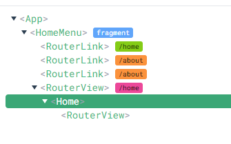
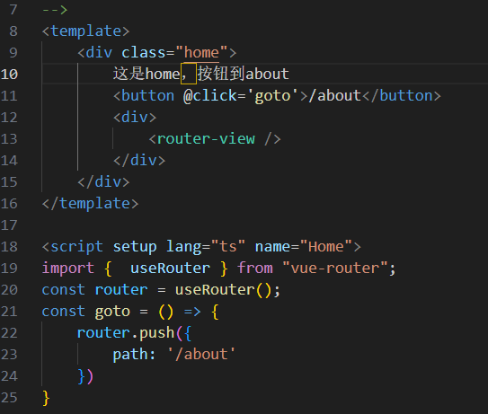
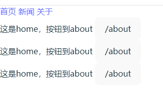

<!--
 * @Date: 2024-06-27 17:21:54
 * @LastEditors: likai 2806699104@qq.com
 * @LastEditTime: 2024-06-28 11:08:06
 * @FilePath: \Study-Vue3-Ts\zmd\mainMenu.md
 * @Description: Do not edit
-->

## Router


<!-- TOC -->

- [Router](#router)
- [router-view](#router-view)
- [router-link](#router-link)

<!-- /TOC -->

## Router 配置
~~~javascript
   // 配置路由规则
 const   routes= [
    { path: '/', redirect: '/home' },
    { path: '/home', component: Home ,
    // redirect: '/child' ,  // 默认跳转到子路由
    children: [
      {
        path: '/child' ,
        name: 'child',
        component: Child,
      }
    ],
    },
    { path: '/about', name:"name与path不同", component: About },
    { path: '/news', component: News }
]

~~~

## router-link 

<strong>router-link组件的属性:</strong>to、replace、append、tag、active-class、exact、event、exact-active-class。
<!-- https://blog.csdn.net/weixin_43905830/article/details/105959537 -->

~~~javascript
// to（必选参数）：类型是string/location
//字符串
<router-link to="path（路径）">AAAA</router-link>

//对象
<router-link :to="{path:'路径'}">AAAA</router-link>
~~~

```javascript
<template>
  <div class="">
    <!-- 会跳转到path 为 /child -->
      <router-link to="child"> 首页 </router-link> 
    <!-- 会跳转到path 为 /about -->
      <router-link to="/about"> 新闻 </router-link>
    <!-- 也会跳转到path 为 /about -->
      <router-link to="about"> 关于 </router-link>
  </div>
  <RouterView />
</template>
```


## router-view 
vue 路由的内置组件  <strong>router-view </strong> 
***
<strong>router-view </strong> 嵌套如何渲染？ 怎么知道是哪一个？ 
<br/>

~~~javascript
<template>
  <div class="">
      <router-link to="/home"> 首页 </router-link>
      <router-link to="/about"> 新闻 </router-link>
      <router-link to="/about"> 关于 </router-link>
  </div>
  <RouterView />
</template>

~~~



<br/>

现在在 home.vue 中添加 <strong>router-view</strong>

~~~javascript
<template>
    <div class="home">
        这是home，按钮到about
        <button @click='goto'>/about</button>
        <div>
            <router-view />
        </div>
    </div>
</template>

<script setup lang="ts" name="Home">
import {  useRouter } from "vue-router";
const router = useRouter();
const goto = () => {
    router.push({
        path: '/child'
    })
}

</script>
~~~
<!-- [](https://markdown.com.cn) -->


多个 router-view是如何渲染？ 怎么知道是哪一个？ 

如果这样 ？  各路由渲染页面没有 <strong>router-view</strong> 则会渲染多个

~~~javascript
<template>
  <div class="">
      <router-link to="/home"> 首页 </router-link>
      <router-link to="/about"> 新闻 </router-link>
      <router-link to="/about"> 关于 </router-link>
  </div>
  <RouterView />
  <RouterView />
  <RouterView />
</template>

~~~



 

## router 嵌套

如果存在嵌套的路由，那么嵌套的子路由的组件会渲染在父路由的 router-view 中。
### router-link 嵌套
```javascript
<template>
  <div class="">
    <!-- 会跳转到path 为 /child -->
      <router-link to="child"> 首页 </router-link> 
  </div>
  <RouterView />
</template>
```
~~~ html
// home.vue 父路由
<template>
    <div class="home">
        这是home，按钮到about
        <button @click='goto'>/about</button>
        <div>
          <!-- 显示 child -->
            <router-view />
        </div>
    </div>
</template>
~~~
上述根据路由 在home.vue 父路由 的 <router-view /> 中显示 child

### 嵌套路由 router.push
~~~javascript
<template>
  <div class="">
    <button @click='gotos()'>child</button>
    <!-- 会跳转到path 为 /about -->
      <router-link to="child"> 首页 </router-link> 
      <router-link to="/about"> 新闻 </router-link>
      <router-link to="about"> 关于 </router-link>
  </div>
  <RouterView />
</template>
~~~
点击 child 按钮，会跳转到 /child, 显示 child 组件 ,并且会显示父组件 ，在父路由的 router-view 中显示 child 组件


如果 父路由没有 router-view，则不会显示子路由的组件, 但父组件内容会显示


## keep-alive在路由中

~~~javascript
    <transition name="fade">
        <router-view v-slot="{ Component }">
            <keep-alive >
                <component :is="Component"></component>
            </keep-alive>
        </router-view>
    </transition>
~~~


