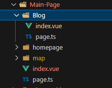
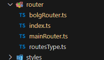

# 路由设计 
<!-- TOC -->

- [路由设计](#路由设计)
    - [路由文件](#路由文件)

<!-- /TOC -->
> 使用文件夹形式进行路由设计
<br>
每一个文件夹含有一个 <strong>index.vue</strong> 文件 与 <strong>page.ts</strong> 文件



> 路由文件 命名规则
1. 首字母大写-短横线-小写
2. 模块名称-功能名称-路由名称

> 子路由


## 路由文件
<br>
由路由类型-routesType.ts、模块名称-mainRouter.ts、路由创建组成
<br>



<br>
路由生成例子：

[main-router.ts](../../src/router/mainRouter.ts)

[bolg-router.ts](../../src/router/bolgRouter.ts)

```ts
import { RouteMeta} from 'vue-router'
import { MyRouteRecord } from './routesType'

 // 
// 定义命名空间常量  
const namespace = 'Bolg';  
export const comVue = import.meta.glob([`../views/Bolg/**/*.vue`],{
  eager: true,
  import: 'default'
}) 


export const pages=  import.meta.glob(['../views/Bolg/**/*.ts'],{
  eager: true,
  import: 'default'
})

const routers :MyRouteRecord[] = Object.entries(pages).map(([path,meta])=>{
  const components = path.replace('/page.ts','/index.vue')
 path  = path.replace('../views','').replace('/page.ts','') || '/' ///Bolg
 
  return  {
    path,
    name: path.replace(/^\//, '').replace(/\//g, '-') || namespace, // 根据 path 生成一个 name（可选，取决于你的需求）,
    component:  comVue[components]  , //About,
    meta:meta as RouteMeta  
  } as MyRouteRecord; // 这里我们使用了类型断言  
})

export default routers

```
